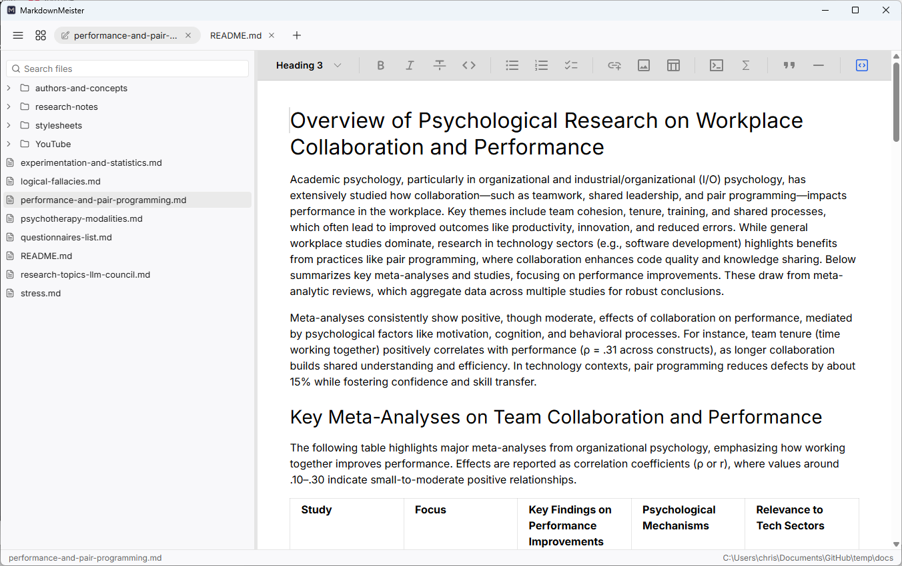

<p align="center">
  
</p>

# MarkdownMeister

A WYSIWYG markdown editor for Windows, macOS and Linux. Write in a formatted view or the raw source, browse a folder in the sidebar, and keep several documents open in tabs. Your files stay plain markdown on disk.

[Project site](https://yetanotherchris.github.io/markdownmeister/) · [Releases](https://github.com/yetanotherchris/markdownmeister/releases/latest) · [Issues](https://github.com/yetanotherchris/markdownmeister/issues)



## Install

### Windows (Microsoft Store)

Search for **MarkdownMeister** in the Microsoft Store, or open the [Store search page](https://apps.microsoft.com/search?query=MarkdownMeister). Installing from the Store carries Microsoft's own signing, so there is no developer-certificate or SmartScreen warning.

### Windows (Scoop)

```sh
scoop bucket add markdownmeister https://github.com/yetanotherchris/markdownmeister
scoop install markdownmeister
```

### macOS and Linux (Homebrew)

```sh
brew tap markdownmeister https://github.com/yetanotherchris/markdownmeister
brew install markdownmeister
```

## Technology

- Milkdown for the WYSIWYG editor, CodeMirror for the source view.
- Electron and TypeScript.
- Built spec-first with [Spec Kit](https://github.com/github/spec-kit): the specification is the source of truth, and code follows it.
- Developed with DeepSeek, Claude, GPT, and GLM.

## Learn more

Features, keyboard shortcuts, settings, and folder actions are documented on the [project site](https://yetanotherchris.github.io/markdownmeister/). MarkdownMeister is free and open source under the [MIT licence](LICENSE).
